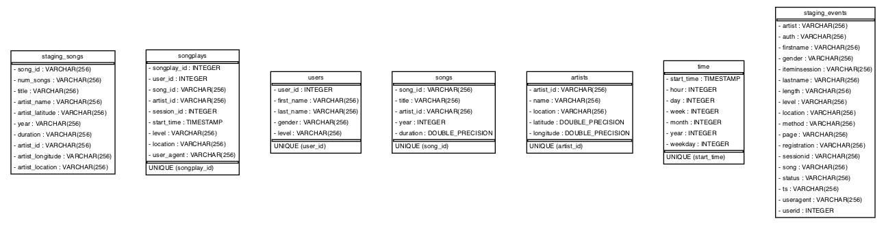

# Project: Data Warehouse
## 1.Project description 
This project is a homework for Udacity Data Engineering Nanodegree Program. That is the third homework. The theme is DateWarehouse.
The task of project is following:
1. To develop DataWerehouse structure with staging and resulting areas
2. To develop ETL to import incoming data from s3 and process it to resulting table

## 2.Database design
Database structure is defined at **sql_queries.py** by CREATE TABLE statements. Following tables are created for that project:

### 2.1 Fact table 
> **songplays** - records in log data associated with song plays i.e. records with page NextSong
> songplay_id, start_time, user_id, level, song_id, artist_id, session_id, location, user_agent

### 2.2 Dimension tables

> **users** - users in the app
> user_id, first_name, last_name, gender, level

> **songs** - songs in music database
> song_id, title, artist_id, year, duration

> **artists** - artists in music database
> artist_id, name, location, latitude, longitude

> **time** - timestamps of records in songplays broken down into specific units
> start_time, hour, day, week, month, year, weekday
### 2.3 Stage tables 
> **staging_events_table** raw data from S3 for logs

> **staging_songs_table** raw data from S3 for songs

### 2.3 ER model


[Image](https://github.com/eruslan/AWSDataModel/blob/master/sparkifydb_erd.png)

## 3. ETL Process
The ETL process is performed by the **etl.py** python script.

### 3.1 ETL Input - Songs data
The songs dataset is at path specified at dwh.cfg under [s3] SONG_DATA key. 
File structure example:

```javascript
{"num_songs": 1, 
"artist_id": "ARJIE2Y1187B994AB7",
"artist_latitude": null,
"artist_longitude": null, 
"artist_location": "",
"artist_name": "Line Renaud", 
"song_id": "SOUPIRU12A6D4FA1E1",
"title": "Der Kleine Dompfaff",
"duration": 152.92036,
"year": 0}
```
### 3.2 ETL Input - Logs data
The logs dataset is at path specified at dwh.cfg under [s3] LOG_DATA key. 
File structure example:

```javascript
{"artist":"Mr Oizo",
"auth":"Logged In",
"firstName":"Kaylee",
"gender":"F",
"itemInSession":3,
"lastName":"Summers",
"length":144.03873,
"level":"free",
"location":"Phoenix-Mesa-Scottsdale, AZ",
"method":"PUT",
"page":"NextSong",
"registration":1540344794796.0,
"sessionId":139,
"song":"Flat 55",
"status":200,
"ts":1541106352796,
"userAgent":"\"Mozilla\/5.0 (Windows NT 6.1; WOW64) AppleWebKit\/537.36 (KHTML, like Gecko) Chrome\/35.0.1916.153 Safari\/537.36\"",
"userId":"8"}
```
Following path files is used to structure json during load into stage
[s3] LOG_JSONPATH

### 3.3 ETL Flow
The import sequence of **etl.py** is following
1. All the data from logs and songs S3 files is imported into two staging tables - staging_events_table and staging_songs_table. The column names are the same as attribute names in files. No constraints applied at this point
2. Dim tabels are filled with data. Songs data goes to artists and songs dimensions, Events data goes to time and users. The data is requested with "distinct" clause but no special further deduplicating actions are performed. There are known duplicats in artists for example where there are two records for the same artist name.
3. The fact table songplays is populated from events table with joins to dimensions table.


## 4. Project Repository files 

Folowing project files were provided as an input:


- __create_tables.py__       Run this script first to create local database and tabels. No changes applied. 

- __sql_queries.py__         This scripts determis the set of SQL statements that are used in __create_tables.py__ and __etl.py__. There are statements to create, drop, copy data from S3 and process data from staging to result tables by inserts. That file was modified. 
- __dwh.cfg__  Congfig file contains [S3],[Cluster] and [IAM USER] sections describing cluster configuration                    
- __etl.py__   Run this script to perform the import. There is no garantee that dublicates are not created when script is ran multiple times. Please always run  __create_tables.py__ before  __etl.py__ to avoid dublicates. 
- __sparkifydb_erd.png__ ER Diagramm

## 5. How To Run the Project

1. pip install following imports: 
          1. import configparser
          2. import psycopg2
          3. import time 
2. The RedShift cluster with an IAM role to perform import must be configured and described at dwh.cfg
3. Run create_tables.py to create tables
4. Please note that full run Run etl.py

## 6. Additional info

> The full ETL process takes lots of time. For short runs specify SONG_DATA=s3://udacity-dend/song-data/A in dwh.cfg 

> Modified .py files were formated by autopep8 in VSCode.

> ER diagramm generated by https://pypi.org/project/sqlalchemy_schemadisplay/
